---

## Ingredients

* 600 g **beef heart**, sliced into thin pieces  
* 2 tbsp **Peruvian chili paste (aji panca)**  
* 2 cloves **garlic**, minced  
* 2 tbsp **soy sauce**  
* 1 tbsp **wine or rice vinegar**  
* 1 tbsp **honey or maple syrup**  
* 1 tsp **ground cumin**  
* 1 tsp **dried oregano**  
* Juice of **1/2 lime**  
* Salt and pepper to taste  

---

## Instructions

1. **Make the marinade** – In a bowl, mix chili paste, soy sauce, vinegar, honey, garlic, cumin, oregano, and lime juice.  
2. **Marinate the meat** – Add the sliced heart, coat well, and refrigerate for at least 2 hours (preferably overnight).  
3. **Prepare skewers** – If using wooden skewers, soak them in water for 30 minutes.  
4. **Grill or pan-sear** – Cook on a hot grill or grill pan for 2–3 minutes per side until lightly charred but still tender.  
5. **Serve immediately** – Best served with roasted potatoes, corn, or a lime-cilantro salad.  

---

## Equipment

* Mixing bowl  
* Skewers  
* Grill or grill pan  

---

## Notes

* If using **aji panca**, add a bit of **aji amarillo** for more heat.  
* Avoid overcooking — beef hearts can become tough.  
* The same marinade works well with chicken or tofu.  

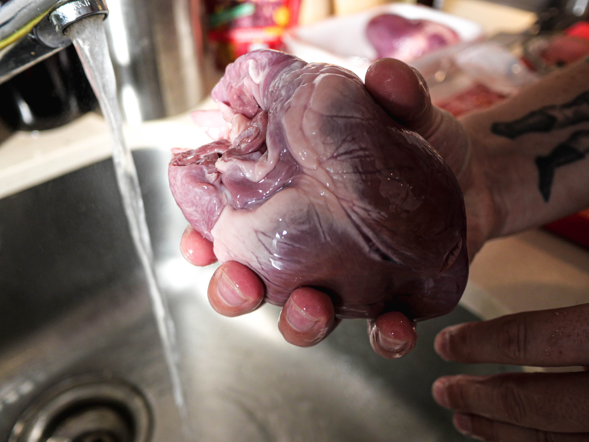
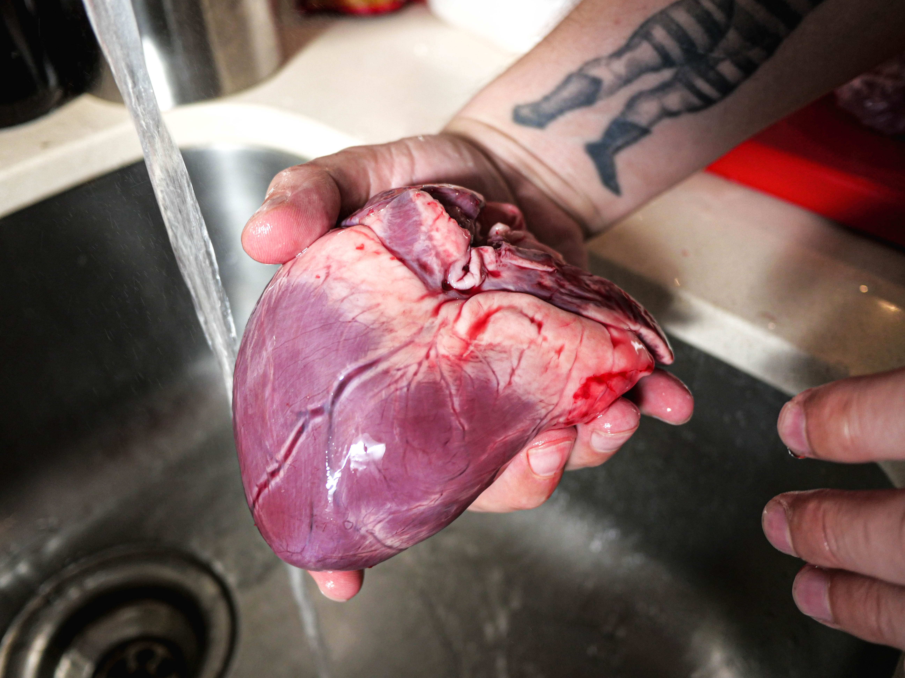
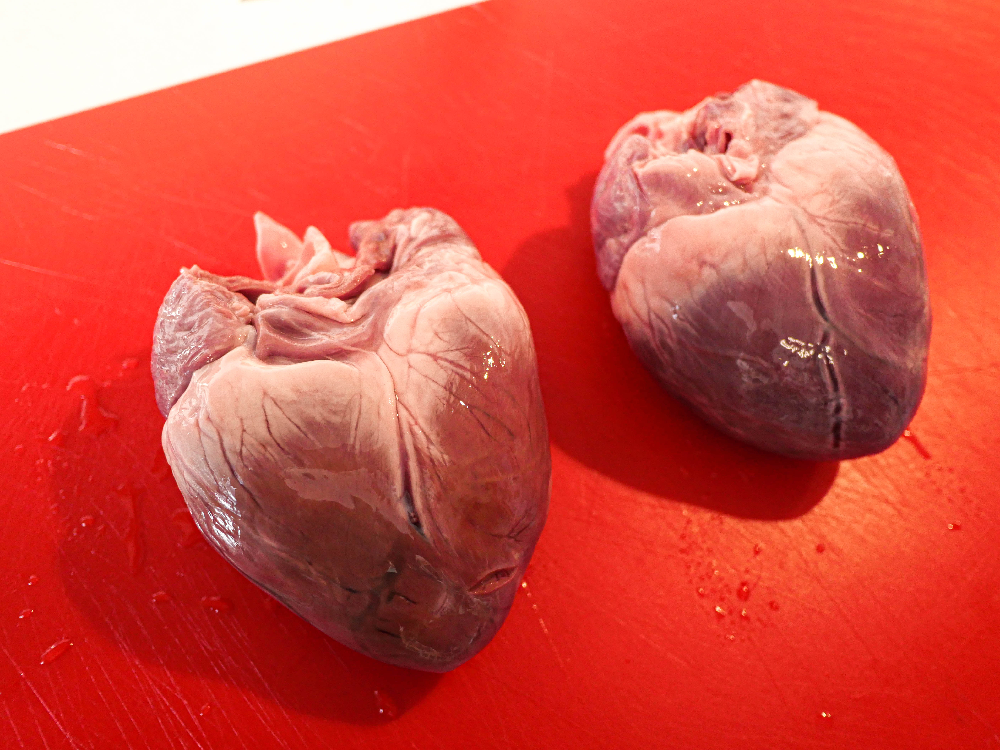
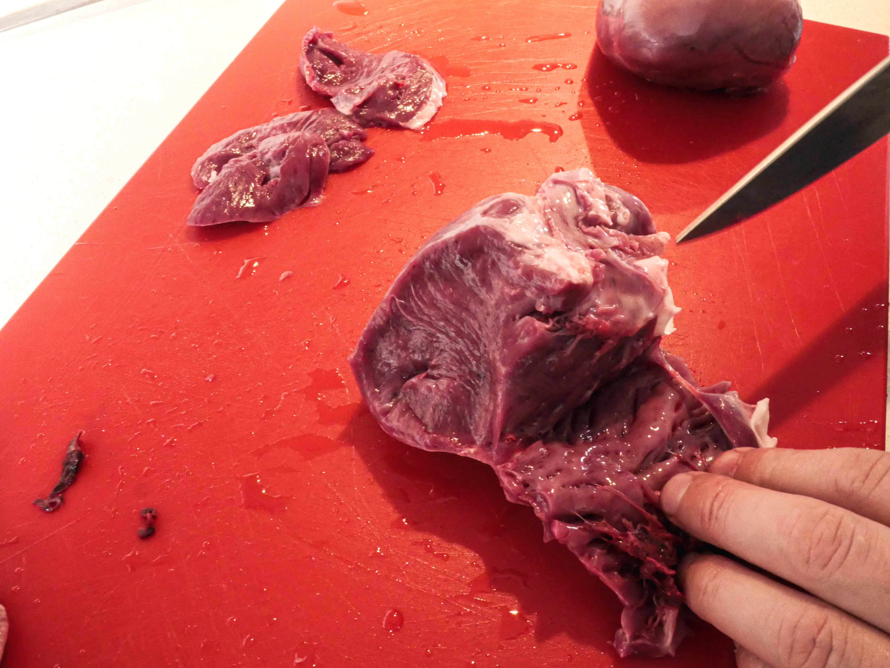
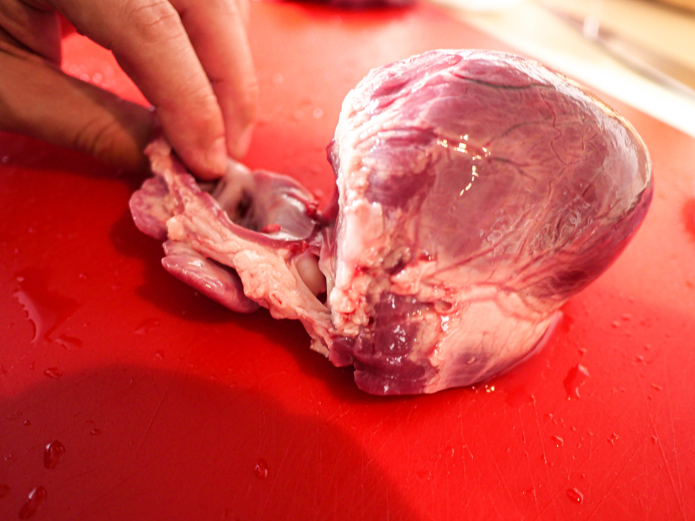
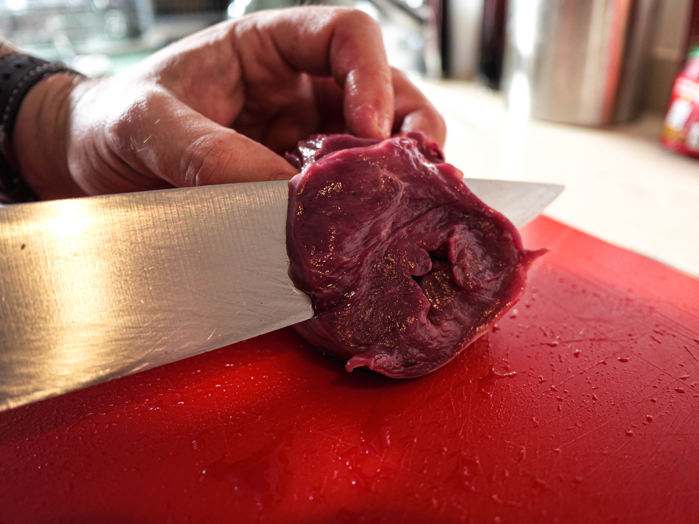
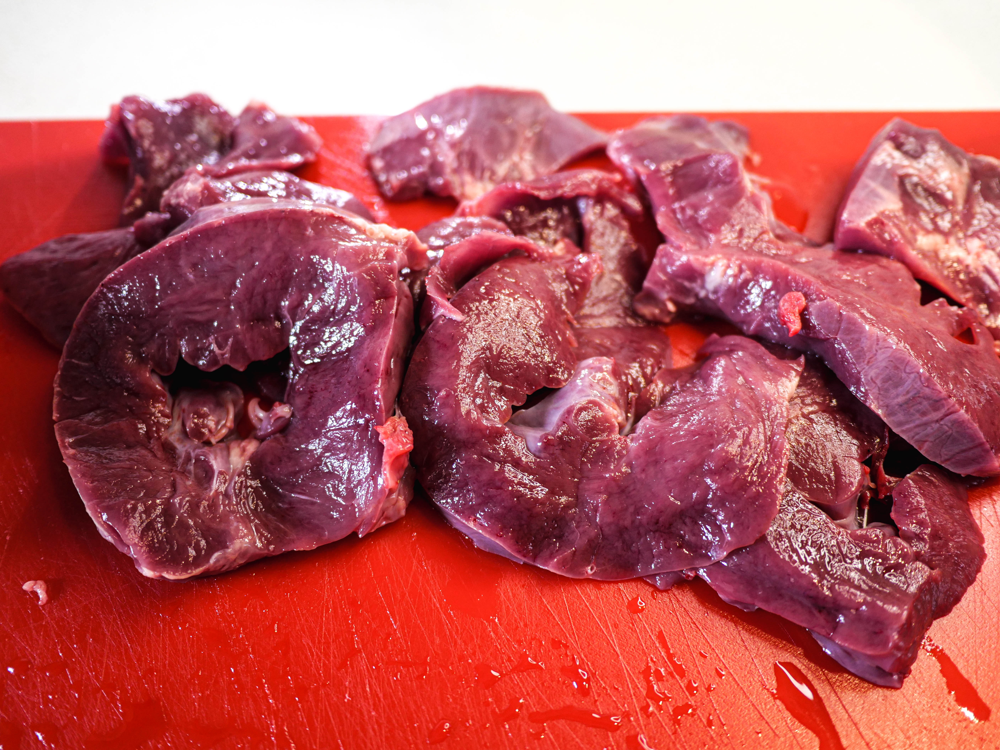
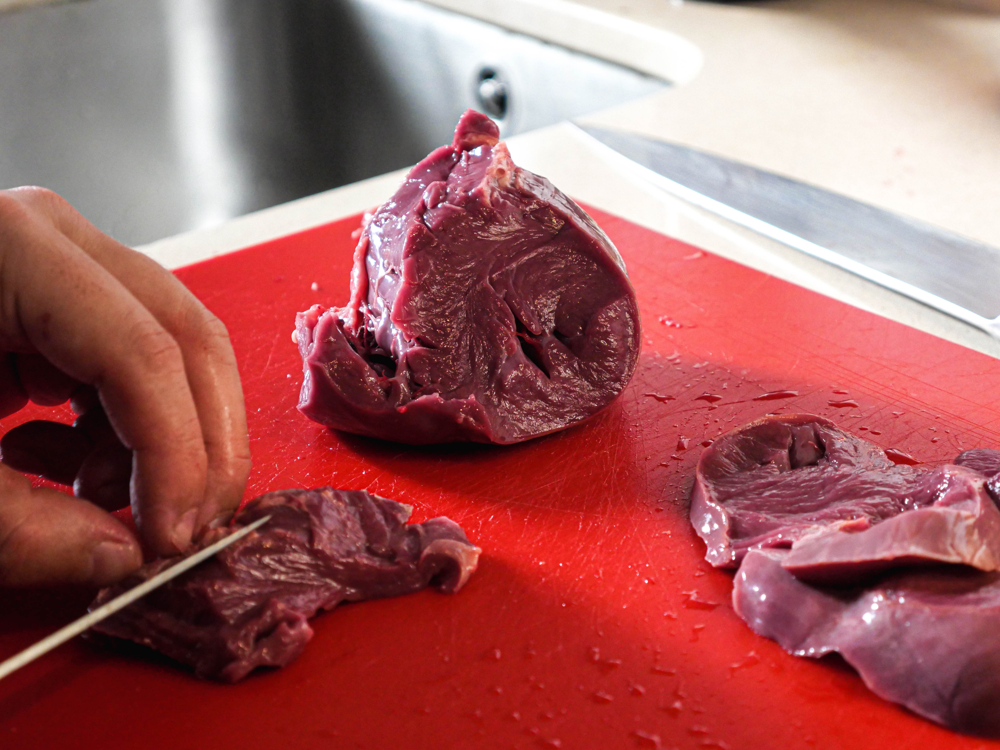
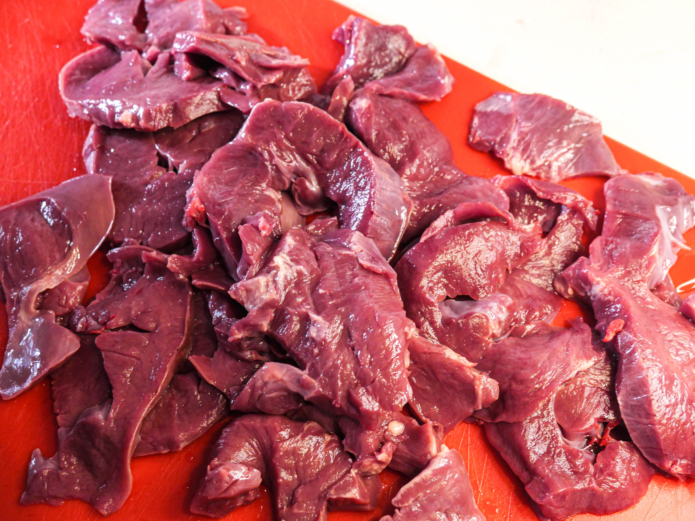
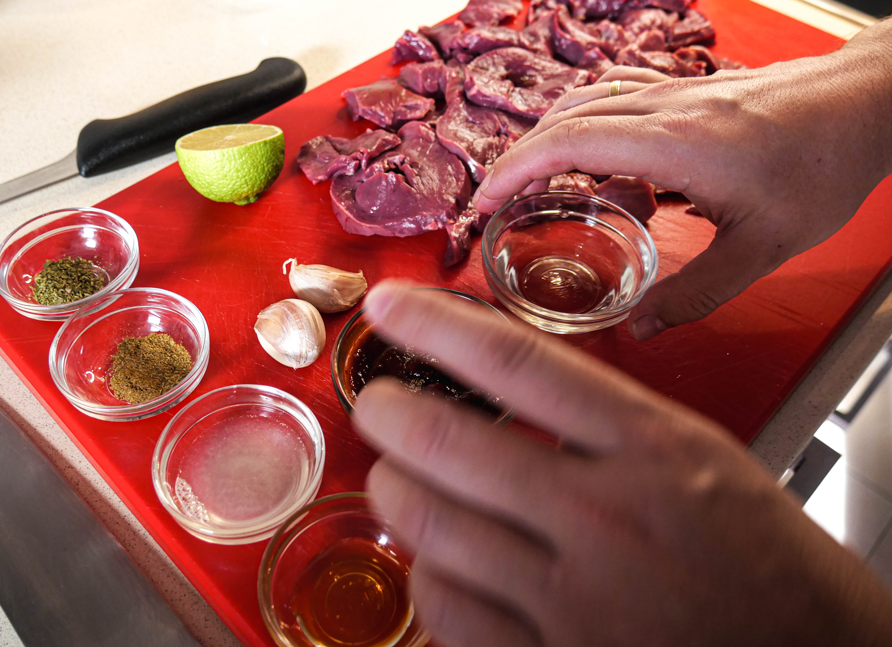
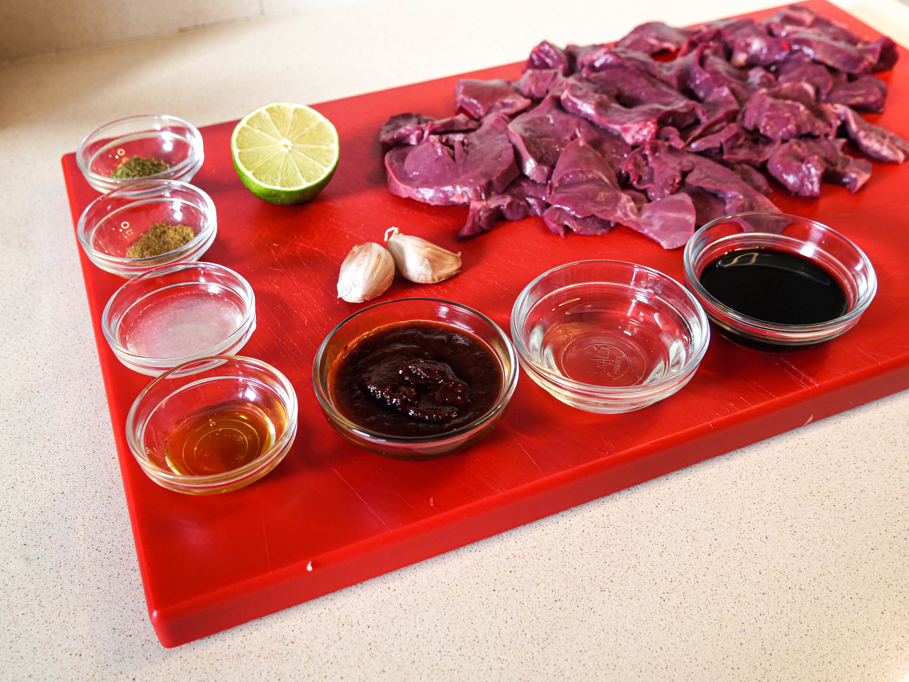
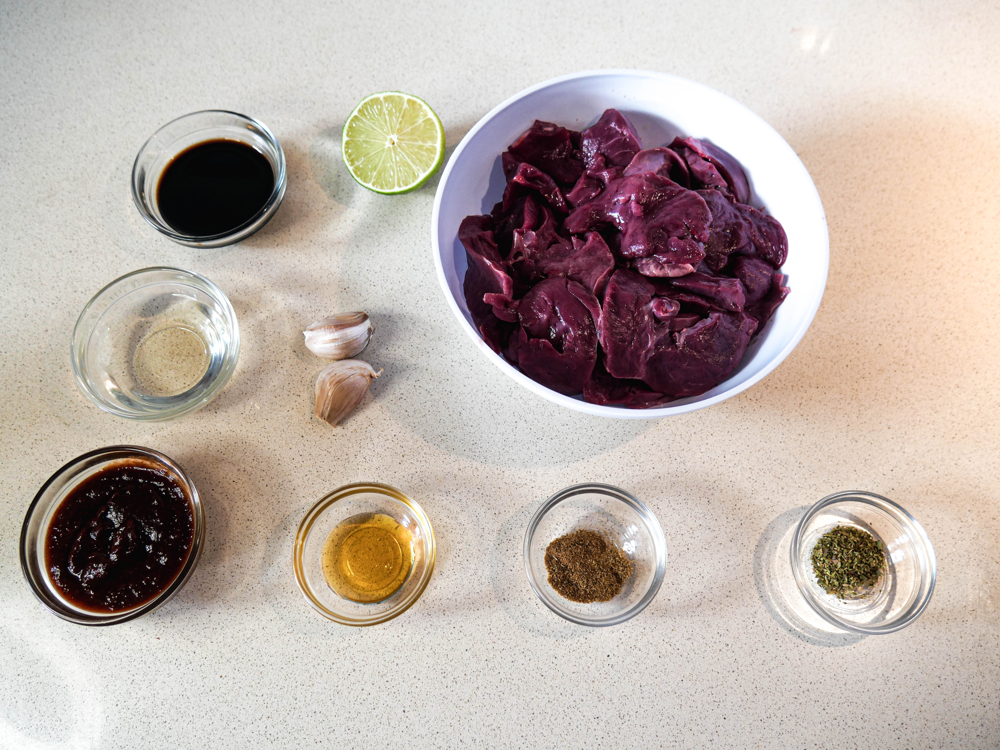
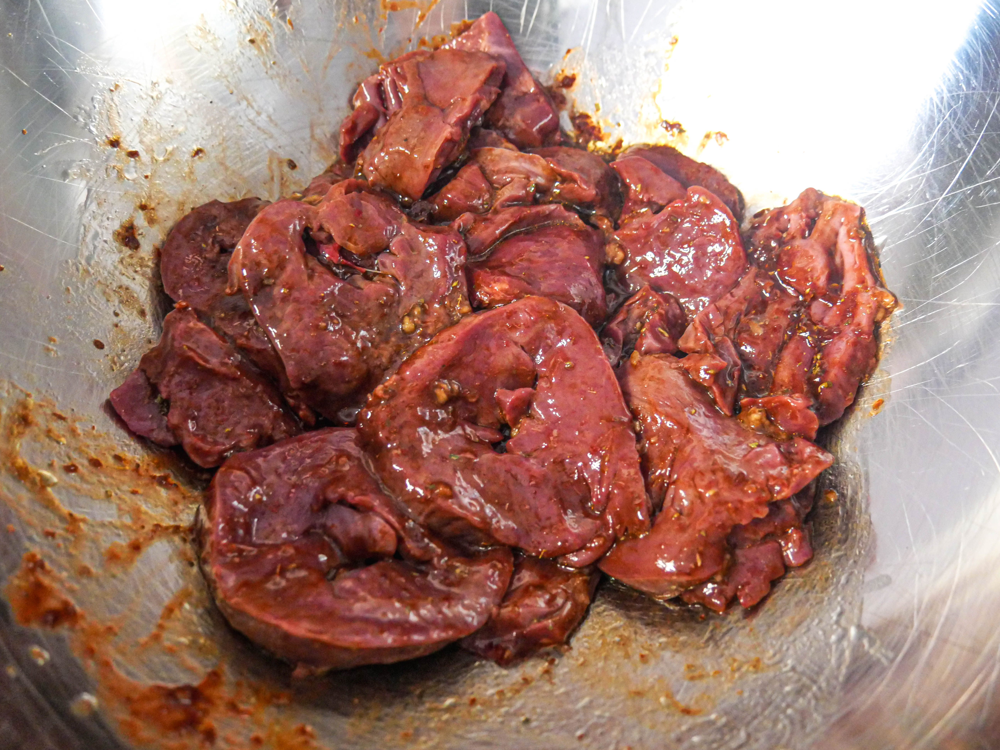
