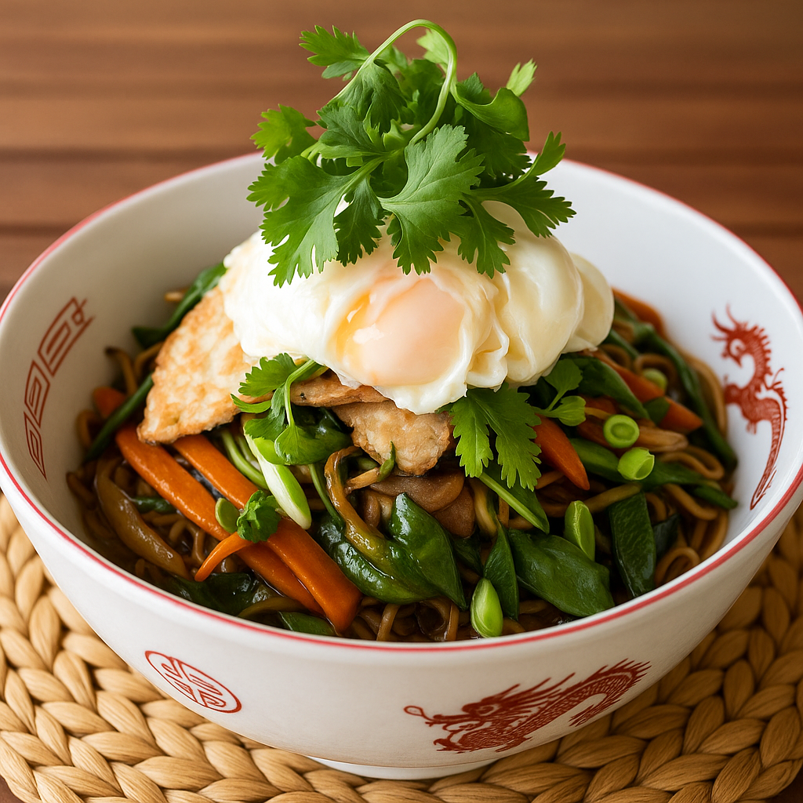

---

## Ingredients

* 150 g **egg noodles**
* 2 **eggs**
* 1 small **carrot**, cut into thin sticks
* 1 small **zucchini**, cut into thin sticks
* 1 small **onion**, thinly sliced
* 1 **bell pepper**, thinly sliced
* 50 g **snow peas**
* 3–4 **mushrooms**, sliced
* 2 tbsp **soy sauce**
* 1 tbsp **oyster sauce** (optional)
* 1 tsp **sesame oil**
* 1 tbsp **vegetable oil**
* 1 **garlic clove**, minced
* A few drops **chili oil** or **hot sauce** (optional)
* **Fresh coriander**, for garnish
* **Salt and pepper**, to taste
* 1 **spring onion**, chopped (for topping)

---

## Steps

1. **Cook the noodles** – Boil the noodles according to the package instructions, then drain and toss lightly with sesame oil to prevent sticking.
2. **Prepare the vegetables** – Slice all vegetables into thin, even pieces.
3. **Stir-fry the vegetables** – Heat vegetable oil in a wok or large pan over high heat. Add garlic, onion, carrot, and bell pepper. Stir-fry for 2–3 minutes until slightly softened.
4. **Add remaining vegetables** – Add mushrooms, snow peas, and zucchini. Continue stir-frying for another 2 minutes.
5. **Combine with noodles** – Add the cooked noodles, soy sauce, and oyster sauce (if using). Toss everything together until evenly coated and hot.
6. **Fry the eggs** – In a separate pan, fry the eggs until the whites are set but yolks remain soft.
7. **Assemble the bowl** – Serve the noodles in deep bowls, top each portion with a fried egg, sprinkle with chopped spring onion, drizzle a bit of chili oil if desired, and finish with a generous handful of fresh coriander.

---

## Equipment

* Wok or large frying pan  
* Saucepan (for noodles)  
* Spatula  
* Knife and cutting board  

---

## Notes

* For a vegan version, replace the fried egg with tofu and skip the oyster sauce.  
* You can use any quick-cooking vegetables such as baby corn, cabbage, or bean sprouts.  
* Drizzle a bit of lime juice before serving for a fresh twist.  

